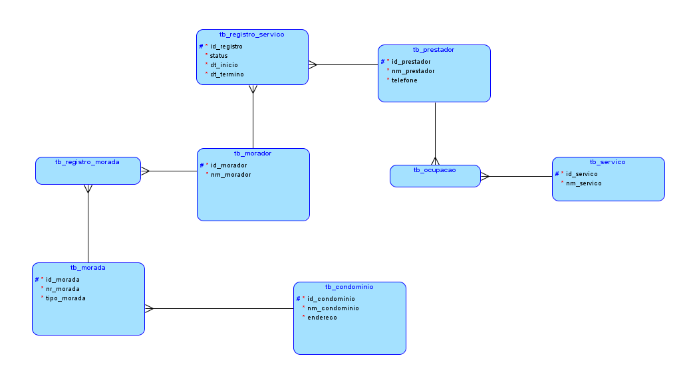

<h1>FIAP Fase 1 : Capítulo 5 </h1>

<h3>Início</h3>

No <a href="https://github.com/Amorim-cyber/fiap2_fase1_cap4">projeto do capítulo 4</a> montei as entidades de um sistema que facilite o encontro de moradores de condomínios com prestadores de serviços. O sistema apresenta também um controle de registro de serviço caso o morador queira contratar o prestador.  A relação ficou da seguinte forma: 



* <b>tb_condominio:</b> Tabela que vai armazenar dados de condomínio. Contém o nome e endereço do condomínio.
* <b>tb_morada:</b> Tabela que vai armazenar dados de morada. Contém o numero da morada e seu tipo (CASA ou APARTAMENTO).
* <b style="color:grey">Relação morada_condominio:</b> Uma morada deve pertencer à um condomínio. Um condomínio pode possuir uma ou mais de uma morada.
* <b>tb_morador:</b> Tabela que vai armazenar dados de morador. Contém nome do morador. 
* <b style="color:grey">Relação morada_morador:</b> Uma morada deve ser habitada por um ou mais moradores e um morador deve morar em pelo menos uma morada.
* <b>tb_servico:</b> Tabela que vai armazenar dados do serviço. Contém o nome do serviço.
* <b>tb_prestador:</b> Tabela que vai armazenar dados do prestador de serviço. Contém o nome, número de telefone do prestador.
* <b style="color:grey">Relação prestador_servico:</b> Um prestador deve oferecer pelo menos um serviço e um serviço deve estar contido em pelo menos um prestador.
* <b>tb_registro_servico:</b> Tabela que vai armazenar dados do registro de serviço. Contém a data de inicio, a data de fim de serviço e o status do registro.
* <b style="color:grey">Relação prestador_registro:</b> Um prestador de serviço deve ser registrado e um registro deve conter um prestador de serviço.
* <b style="color:grey">Relação morador_registro:</b> Um morador deve ser registrado e um registro deve conter um morador.

<h3>OBJETIVO DO PROJETO:</h3>

Conforme solicitado, este projeto tem como objetivo montar o script de criação de tabelas, criar as demais classes, incluir as relações entre entidades no programa e implementar as operações de CRUD.

<HR> 

<h3>Montar o script</h3>

O script que efetua o `create` das tabelas, sequências e chaves estrangeiras foi desenvolvido da seguinte forma:

`````sql
-- DELETAR HISTORICO (COMPUTE CASO AS ESTRURAS JA EXISTAM NO BANCO) --

drop table tb_condominio cascade constraints;
drop table tb_morada cascade constraints;
drop table tb_morador cascade constraints;
drop table tb_ocupacao cascade constraints;
drop table tb_prestador cascade constraints;
drop table tb_registro_morada cascade constraints;
drop table tb_registro_servico cascade constraints;
drop table tb_servico cascade constraints;
drop sequence sq_tb_condominio;
drop sequence sq_tb_morada;
drop sequence sq_tb_morador;
drop sequence sq_tb_prestador;
drop sequence sq_tb_registro;
drop sequence sq_tb_servico;


-- CRIA��O DE SEQUENCES --

create sequence sq_tb_condominio start with 1 increment by 1;
create sequence sq_tb_morada start with 1 increment by 1;
create sequence sq_tb_morador start with 1 increment by 1;
create sequence sq_tb_prestador start with 1 increment by 1;
create sequence sq_tb_registro start with 1 increment by 1;
create sequence sq_tb_servico start with 1 increment by 1;


-- CRIA��O DE TABELAS --

CREATE TABLE tb_condominio (
    id_condominio  NUMBER(10) NOT NULL,
    nm_condominio  VARCHAR2(100) NOT NULL,
    endereco       VARCHAR2(200) NOT NULL
);

ALTER TABLE tb_condominio ADD CONSTRAINT tb_condominio_pk PRIMARY KEY ( id_condominio );

CREATE TABLE tb_morada (
    id_morada                    NUMBER(10) NOT NULL,
    nr_morada                    NUMBER(10) NOT NULL,
    tipo_morada                  VARCHAR2(20) NOT NULL,
    tb_condominio_id_condominio  NUMBER(10) NOT NULL
);

ALTER TABLE tb_morada ADD CONSTRAINT tb_morada_pk PRIMARY KEY ( id_morada );

CREATE TABLE tb_morador (
    id_morador  NUMBER(10) NOT NULL,
    nm_morador  VARCHAR2(100) NOT NULL
);

ALTER TABLE tb_morador ADD CONSTRAINT tb_morador_pk PRIMARY KEY ( id_morador );

CREATE TABLE tb_prestador (
    id_prestador  NUMBER(10) NOT NULL,
    nm_prestador  VARCHAR2(100) NOT NULL,
    telefone      NUMBER(19) NOT NULL
);

ALTER TABLE tb_prestador ADD CONSTRAINT tb_prestador_pk PRIMARY KEY ( id_prestador );

CREATE TABLE tb_registro_morada (
    tb_morador_id_morador  NUMBER(10) NOT NULL,
    tb_morada_id_morada    NUMBER(10) NOT NULL
);

CREATE TABLE tb_registro_servico (
    id_registro                NUMBER(10) NOT NULL,
    dt_inicio                  TIMESTAMP WITH LOCAL TIME ZONE NOT NULL,
    dt_termino                 TIMESTAMP WITH LOCAL TIME ZONE NOT NULL,
    tb_prestador_id_prestador  NUMBER(10) NOT NULL,
    tb_morador_id_morador      NUMBER(10) NOT NULL,
    tb_servico_id_servico      NUMBER(10) NOT NULL,
    status                     VARCHAR2(15) NOT NULL
);

ALTER TABLE tb_registro_servico ADD CONSTRAINT tb_registro_servico_pk PRIMARY KEY ( id_registro );

CREATE TABLE tb_servico (
    id_servico  NUMBER(10) NOT NULL,
    nm_servico  VARCHAR2(255) NOT NULL
);

ALTER TABLE tb_servico ADD CONSTRAINT tb_servico_pk PRIMARY KEY ( id_servico );

CREATE TABLE tb_ocupacao (
    tb_prestador_id_prestador  NUMBER(10) NOT NULL,
    tb_servico_id_servico      NUMBER(10) NOT NULL
);

--  CHAVES ESTRANGEIRAS  --

ALTER TABLE tb_morada
    ADD CONSTRAINT mor_condo_fk FOREIGN KEY ( tb_condominio_id_condominio )
        REFERENCES tb_condominio ( id_condominio );

ALTER TABLE tb_ocupacao
    ADD CONSTRAINT tb_ocupacao_tb_prestador_fk FOREIGN KEY ( tb_prestador_id_prestador )
        REFERENCES tb_prestador ( id_prestador );

ALTER TABLE tb_ocupacao
    ADD CONSTRAINT tb_ocupacao_tb_servico_fk FOREIGN KEY ( tb_servico_id_servico )
        REFERENCES tb_servico ( id_servico );

ALTER TABLE tb_registro_morada
    ADD CONSTRAINT regis_mor_fk FOREIGN KEY ( tb_morada_id_morada )
        REFERENCES tb_morada ( id_morada );
        
ALTER TABLE tb_registro_morada
    ADD CONSTRAINT regis_mora_fk FOREIGN KEY ( tb_morador_id_morador )
        REFERENCES tb_morador ( id_morador );

ALTER TABLE tb_registro_servico
    ADD CONSTRAINT regis_serv_mora_fk FOREIGN KEY ( tb_morador_id_morador )
        REFERENCES tb_morador ( id_morador );

ALTER TABLE tb_registro_servico
    ADD CONSTRAINT regis_serv_pres_fk FOREIGN KEY ( tb_prestador_id_prestador )
        REFERENCES tb_prestador ( id_prestador );


`````

<b>OBS:</b> O programa em `java` efetua automaticamente todo o processo acima com o `hibernate`. Contudo caso haja algum problema, você pode utiliza-ló para criar manualmente as estruturas no seu banco. 

<hr>
<h3>Criando as demais classes</h3>

1. <b>Registro.java</b>

   Neste projeto, coloquei o enum `Estado` para fora da classe, criando assim a classe `Estado.java`

   ````java
   package br.com.encontro.entity;
   
   public enum Estado {
   	
   	ABERTO, FECHADO
   
   }
   
   ````

2. <b>Condominio.java</b>

   `````java
   package br.com.fiap.domain;
   
   import java.util.List;
   
   import javax.persistence.Column;
   import javax.persistence.Entity;
   import javax.persistence.GeneratedValue;
   import javax.persistence.GenerationType;
   import javax.persistence.Id;
   import javax.persistence.OneToMany;
   import javax.persistence.SequenceGenerator;
   import javax.persistence.Table;
   
   @Entity
   @Table(name="tb_condominio")
   public class Condominio {
   
   	@Id
   	@SequenceGenerator(name="condominio",sequenceName="sq_tb_condominio",allocationSize=1)
   	@GeneratedValue(strategy=GenerationType.SEQUENCE, generator="condominio")
   	@Column(name="id_condominio")
   	private int id;
   	
   	
   	@Column(name="nm_condominio",nullable=false,length=100)
   	private String nome;
   	
   	
   	@Column(name="endereco",nullable=false,length=200)
   	private String endereco;
   	
   	@OneToMany(mappedBy = "condominio")
   	private List<Morada> moradas;
   
   	public Condominio() {
   	}
   
   	public Condominio(int id, String nome, String endereco, List<Morada> moradas) {
   		this.id = id;
   		this.nome = nome;
   		this.endereco = endereco;
   		this.moradas = moradas;
   	}
   
   
   
   	public int getId() {
   		return id;
   	}
   
   	public void setId(int id) {
   		this.id = id;
   	}
   
   	public String getNome() {
   		return nome;
   	}
   
   	public void setNome(String nome) {
   		this.nome = nome;
   	}
   
   	public String getEndereco() {
   		return endereco;
   	}
   
   	public void setEndereco(String endereco) {
   		this.endereco = endereco;
   	}
   
   	public List<Morada> getMoradas() {
   		return moradas;
   	}
   
   	public void setMoradas(List<Morada> moradas) {
   		this.moradas = moradas;
   	}
   	
   	
   	
   }
   
   `````

   Após criada a classe incluir a seguinte linha em `persistence.xml`

   ````xml
   <class>br.com.encontro.entity.Condominio</class>
   ````

3. <b>Morada.java</b>

   Antes de criar a classe, vamos criar o enum `Estrutura.java`

   ````java
   package br.com.encontro.entity;
   
   public enum Estrutura {
   
   	CASA, APARTAMENTO
   	
   }
   
   ````

   Segue abaixo o código da classe

   ````java
   package br.com.fiap.domain;
   
   import java.util.List;
   
   import javax.persistence.CascadeType;
   import javax.persistence.Column;
   import javax.persistence.Entity;
   import javax.persistence.EnumType;
   import javax.persistence.Enumerated;
   import javax.persistence.GeneratedValue;
   import javax.persistence.GenerationType;
   import javax.persistence.Id;
   import javax.persistence.JoinColumn;
   import javax.persistence.ManyToMany;
   import javax.persistence.ManyToOne;
   import javax.persistence.SequenceGenerator;
   import javax.persistence.Table;
   
   @Entity
   @Table(name="tb_morada")
   public class Morada {
   
   	@Id
   	@SequenceGenerator(name="morada",sequenceName="sq_tb_morada",allocationSize=1)
   	@GeneratedValue(strategy=GenerationType.SEQUENCE, generator="morada")
   	@Column(name="id_morada")
   	private int id;
   	
   	@Column(name="nr_morada",nullable=false)
   	private int numero;
   	
   	@Enumerated(EnumType.STRING)
   	@Column(name="tipo_morada")
   	private Estrutura estrutura;
   	
   	@ManyToMany(mappedBy="moradas")
   	private List<Morador> moradores;
   	
   	@JoinColumn(name = "id_condominio")
   	@ManyToOne(cascade=CascadeType.PERSIST)
   	private Condominio condominio;
   
   	public Morada() {
   	}
   
   	public Morada(int id, int numero, Estrutura estrutura, List<Morador> moradores, Condominio condominio) {
   		this.id = id;
   		this.numero = numero;
   		this.estrutura = estrutura;
   		this.moradores = moradores;
   		this.condominio = condominio;
   	}
   
   	public int getId() {
   		return id;
   	}
   
   	public void setId(int id) {
   		this.id = id;
   	}
   
   	public int getNumero() {
   		return numero;
   	}
   
   	public void setNumero(int numero) {
   		this.numero = numero;
   	}
   
   	public Estrutura getEstrutura() {
   		return estrutura;
   	}
   
   	public void setEstrutura(Estrutura estrutura) {
   		this.estrutura = estrutura;
   	}
   
   	public List<Morador> getMoradores() {
   		return moradores;
   	}
   
   	public void setMoradores(List<Morador> moradores) {
   		this.moradores = moradores;
   	}
   
   	public Condominio getCondominio() {
   		return condominio;
   	}
   
   	public void setCondominio(Condominio condominio) {
   		this.condominio = condominio;
   	}
   	
   	
   	
   	
   }
   
   ````

   Após criada a classe incluir a seguinte linha em `persistence.xml`

   ````xml
   <class>br.com.encontro.entity.Morada</class>
   ````

4. <b>Morador.java</b>

   ````java
   package br.com.fiap.domain;
   
   import java.util.List;
   
   import javax.persistence.CascadeType;
   import javax.persistence.Column;
   import javax.persistence.Entity;
   import javax.persistence.GeneratedValue;
   import javax.persistence.GenerationType;
   import javax.persistence.Id;
   import javax.persistence.JoinTable;
   import javax.persistence.JoinColumn;
   import javax.persistence.ManyToMany;
   import javax.persistence.OneToMany;
   import javax.persistence.SequenceGenerator;
   import javax.persistence.Table;
   
   @Entity
   @Table(name="tb_morador")
   public class Morador {
   
   	@Id
   	@SequenceGenerator(name="morador",sequenceName="sq_tb_morador",allocationSize=1)
   	@GeneratedValue(strategy=GenerationType.SEQUENCE, generator="morador")
   	@Column(name="id_morador")
   	private int id;
   	
   	@Column(name="nm_morador",nullable=false,length=100)
   	private String nome;
   	
   	
   	
   	@ManyToMany(cascade=CascadeType.PERSIST)
   	@JoinTable(joinColumns = @JoinColumn(name="id_morador"), 
   	inverseJoinColumns = @JoinColumn(name="id_morada"), name = "tb_registro_morada")
   	private List<Morada> moradas;
   	
   	@OneToMany(mappedBy = "morador")
   	private List<Registro> registros;
   	
   	public Morador() {
   	}
   	
   	public Morador(int id, String nome, List<Morada> moradas, List<Registro> registros) {
   		this.id = id;
   		this.nome = nome;
   		this.moradas = moradas;
   		this.registros = registros;
   	}
   
   	public int getId() {
   		return id;
   	}
   
   	public void setId(int id) {
   		this.id = id;
   	}
   
   	public String getNome() {
   		return nome;
   	}
   
   	public void setNome(String nome) {
   		this.nome = nome;
   	}
   
   	public List<Morada> getMoradas() {
   		return moradas;
   	}
   
   	public void setMoradas(List<Morada> moradas) {
   		this.moradas = moradas;
   	}
   
   	public List<Registro> getRegistros() {
   		return registros;
   	}
   
   	public void setRegistros(List<Registro> registros) {
   		this.registros = registros;
   	}
   	
   	
   	
   }
   
   ````

   Após criada a classe incluir a seguinte linha em `persistence.xml`

   ````xml
   <class>br.com.encontro.entity.Morador</class>
   ````

5. <b>Servico.java</b>

   Antes de criar a classe, vamos criar o enum `Ocupacao.java`

   ````java
   package br.com.encontro.entity;
   
   public enum Ocupacao {
   
   	PINTOR, ELETRICISTA, PEDREIRO, ENCANADOR
   	
   }
   
   ````

   Segue abaixo o código da classe

   ````java
   package br.com.fiap.domain;
   
   import java.util.List;
   
   import javax.persistence.Column;
   import javax.persistence.Entity;
   import javax.persistence.EnumType;
   import javax.persistence.Enumerated;
   import javax.persistence.GeneratedValue;
   import javax.persistence.GenerationType;
   import javax.persistence.Id;
   import javax.persistence.ManyToMany;
   import javax.persistence.SequenceGenerator;
   import javax.persistence.Table;
   
   @Entity
   @Table(name="tb_servico")
   public class Servico {
   
   	@Id
   	@SequenceGenerator(name="servico",sequenceName="sq_tb_servico",allocationSize=1)
   	@GeneratedValue(strategy=GenerationType.SEQUENCE, generator="servico")
   	@Column(name="id_servico")
   	private int id;
   	
   	@Enumerated(EnumType.STRING)
   	@Column(name="nm_servico")
   	private Ocupacao nome;
   	
   	@ManyToMany(mappedBy="servicos")
   	private List<Prestador> prestadores;
   	
   	public Servico() {
   	}
   
   	public Servico(int id, Ocupacao nome, List<Prestador> prestadores) {
   		super();
   		this.id = id;
   		this.nome = nome;
   		this.prestadores = prestadores;
   	}
   
   	public int getId() {
   		return id;
   	}
   
   	public void setId(int id) {
   		this.id = id;
   	}
   
   	public Ocupacao getNome() {
   		return nome;
   	}
   
   	public void setNome(Ocupacao nome) {
   		this.nome = nome;
   	}
   
   	public List<Prestador> getPrestadores() {
   		return prestadores;
   	}
   
   	public void setPrestadores(List<Prestador> prestadores) {
   		this.prestadores = prestadores;
   	}
   	
   	
   	
   }
   
   ````

   Após criada a classe incluir a seguinte linha em `persistence.xml`

   ````xml
   <class>br.com.encontro.entity.Morador</class>
   ````

<hr>

<h3>Montar relação entre entidades</h3>

Vamos explicar as relações em nosso programa.

* <b>Relação Muitos para Muitos:</b> 

  As entidades `Morador` , `Morada` , `Prestador` e `Servico` possuem relação N x N. Adicionamos as seguintes linhas de código nos seguintes arquivos:

  <b>Morador.java:</b>

  ````java
  @ManyToMany(cascade=CascadeType.PERSIST)
  	@JoinTable(joinColumns = @JoinColumn(name="id_morador"), 
  	inverseJoinColumns = @JoinColumn(name="id_morada"), name = "tb_registro_morada")
  	private List<Morada> moradas;
  ````

   <b>Morada.java:</b>

  ````java
  @ManyToMany(mappedBy="moradas")
  	private List<Morador> moradores;
  ````

  <b>Prestador.java:</b>

  ````java
  @ManyToMany(cascade=CascadeType.PERSIST)
  	@JoinTable(joinColumns = @JoinColumn(name="id_prestador"), 
  	inverseJoinColumns = @JoinColumn(name="id_servico"), name = "tb_ocupacao")
  	private List<Servico> servicos;
  ````

  <b>Servico.java:</b>

  ````java
  @ManyToMany(mappedBy="servicos")
  	private List<Prestador> prestadores;
  ````

* <b>Relação Muitos para Um:</b>

  A entidade `Registro Serviço` possui uma relação de muitos para um com as entidades `Morador` e `Prestador`, da mesma forma que `Morada` tem sobre `Condominio`. Adicionamos as seguintes linhas de código nos seguintes arquivos:

  <b>Registro.java</b>:

  ````java
  @JoinColumn(name = "id_morador")
  	@ManyToOne(cascade=CascadeType.PERSIST)
  	private Morador morador;
  	
  	@JoinColumn(name = "id_prestador")
  	@ManyToOne(cascade=CascadeType.PERSIST)
  	private Prestador prestador;
  ````
  
   <b>Morada.java:</b>
  
  ````java
  @JoinColumn(name = "id_condominio")
  	@ManyToOne(cascade=CascadeType.PERSIST)
  	private Condominio condominio;
  ````
  
  
  
* <b>Relação Um para Muitos:</b>

  As entidades `Morador` e `Prestador` possuem uma relação de um para muitos em relação a `Registro Serviço`, da mesma forma que `Condominio` tem sobre `Morada`. Adicionamos as seguintes linhas de código nos seguintes arquivos:

  <b>Morador.java</b>

  ````java
  @OneToMany(mappedBy = "morador")
  	private List<Registro> registros;
  ````

  <b>Prestador.java</b>

  ````java
  @OneToMany(mappedBy = "prestador")
  	private List<Registro> registros;
  ````

  <b>Condominio.java</b>

  ````java
  @OneToMany(mappedBy = "condominio")
  	private List<Morada> moradas;
  ````
  
  

Pronto! Relações formalizadas!

<hr>

<h3> Implementar o CRUD</h3>

Seguindo com o projeto, vamos criar as operações de incluir, buscar, atualizar e deletar ao nosso programa.

<h4>Incluir:</h4>

Iremos adicionar o arquivo `MainCadastro.java` para testar as inclusões. 

Por motivos educacionais, estamos sempre deletando e recriando o banco em cada execução. Afim de deixar nosso código mais limpo, criei a classe `Mock.java` para incluir os dados.

````java
package br.com.fiap.util;

import java.util.ArrayList;
import java.util.List;

import javax.persistence.EntityManager;

import br.com.fiap.domain.Condominio;
import br.com.fiap.domain.Estado;
import br.com.fiap.domain.Estrutura;
import br.com.fiap.domain.Morada;
import br.com.fiap.domain.Morador;
import br.com.fiap.domain.Ocupacao;
import br.com.fiap.domain.Prestador;
import br.com.fiap.domain.Registro;
import br.com.fiap.domain.Servico;

public class Mock {
	
	public Mock(EntityManager em) {
		
		// Incluindo condominios 
		
				Condominio condominio1 = new Condominio(0,
				"Condomínio do Edifício Yellow Bali",
				"Av. Alfredo Balthazar da Silveira, 289 - bloco 2 - Recreio dos Bandeirantes, Rio de Janeiro - RJ, 22790-710",
				null);
				Condominio condominio2 = new Condominio(0,
				"Condomínio London Green",
				"R. César Lattes, 1000 - Barra da Tijuca, Rio de Janeiro - RJ, 22793-329",
				null);
				
				Condominio condominio3 = new Condominio(0,
				"Vila Pan-Americana",
				"Av. Cláudio Besserman Vianna - Jacarepaguá, Rio de Janeiro - RJ, 22775-036",
				null);
				
				// Incluindo moradas
				
				Morada morada1 = new Morada(0,55,Estrutura.CASA,null,condominio2);
				
				Morada morada2 = new Morada(0,104,Estrutura.APARTAMENTO,null,condominio3);
				
				Morada morada3 = new Morada(0,204,Estrutura.APARTAMENTO,null,condominio1);
				
				Morada morada4 = new Morada(0,105,Estrutura.APARTAMENTO,null,condominio3);
				
				Morada morada5 = new Morada(0,70,Estrutura.CASA,null,condominio2);
				
				List<Morada> moradas1 = new ArrayList<Morada>();
				moradas1.add(morada1);
				
				List<Morada> moradas2 = new ArrayList<Morada>();
				moradas2.add(morada2);
				
				List<Morada> moradas3 = new ArrayList<Morada>();
				moradas3.add(morada3);
				
				List<Morada> moradas4 = new ArrayList<Morada>();
				moradas4.add(morada4);
				moradas4.add(morada5);
				
				// Incluindo moradores
				
				Morador morador1 = new Morador(0,"Mario",moradas1,null);
				Morador morador2 = new Morador(0,"Joana",moradas2,null);
				Morador morador3 = new Morador(0,"Isadora",moradas3,null);
				Morador morador4 = new Morador(0,"David",moradas4,null);
				

				// Incluindo servicos
				
				Servico servico1 = new Servico(0,Ocupacao.ELETRICISTA,null);
				Servico servico2 = new Servico(0,Ocupacao.ENCANADOR,null);
				Servico servico3 = new Servico(0,Ocupacao.PINTOR,null);
				Servico servico4 = new Servico(0,Ocupacao.PEDREIRO,null);
				
				List<Servico> servicos1 = new ArrayList<Servico>();
				servicos1.add(servico1);
				servicos1.add(servico2);
				
				List<Servico> servicos2 = new ArrayList<Servico>();
				servicos2.add(servico3);
				servicos2.add(servico4);
				
				// Incluindo prestadores
				
				Prestador prestador1 = new Prestador(0,"José",24477155,servicos1);
				Prestador prestador2 = new Prestador(0,"Cleiton",24277155,servicos2);
				
				//Incluindo registros
				
				Registro registro1 = new Registro(0,morador1,prestador1,Estado.ABERTO);
				Registro registro2 = new Registro(0,morador2,prestador1,Estado.ABERTO);
				Registro registro3 = new Registro(0,morador3,prestador2,Estado.ABERTO);
				Registro registro4 = new Registro(0,morador4,prestador2,Estado.ABERTO);
				
				// Salvando registros
				
				try {
					em.persist(registro1);
					em.persist(registro2);
					em.persist(registro3);
					em.persist(registro4);
					
					
					em.getTransaction().begin();
					em.getTransaction().commit();
				}catch(Exception e) {
					if(em.getTransaction().isActive()) {
						em.getTransaction().rollback();
					}
				}
		
	}

}

````

Ao executar o arquivo, só precisamos instanciar a classe `Mock.java` para incluir os dados que serão utilizados. 

````java
package br.com.fiap.main;


import javax.persistence.EntityManager;
import javax.persistence.EntityManagerFactory;
import javax.persistence.Persistence;
import br.com.fiap.util.Mock;

public class MainCadastro {

	public static void main(String[] args) {
		EntityManagerFactory fabrica = Persistence.createEntityManagerFactory("encontro");
		EntityManager em = fabrica.createEntityManager();
		
		new Mock(em);
		
		em.close();
		fabrica.close();
		
	}

}

````

Reparem que as inclusões estão em cascata `(cascade=CascadeType.PERSIST)` neste exemplo. O método `persist` está apenas recebendo os objetos da classe `Registro.java`. Ao persistir sobre `Registro`, também persiste sobre `Morador` e `Prestador`, que por sua vez persiste em `Morada` , `Condominio` e `Servico` .

Ao processar o código acima no programa e consultar o SGBD Oracle, podemos perceber que as inclusões foram um sucesso!


<h4>Buscar:</h4>

Para demonstrar as operações de busca vamos criar a classe `MainBuscar.java`. 

````java
package br.com.encontro.main;

import javax.persistence.EntityManager;
import javax.persistence.EntityManagerFactory;
import javax.persistence.Persistence;

import br.com.encontro.entity.Morador;
import br.com.encontro.util.Mock;

public class MainBuscar {

	public static void main(String[] args) {
		EntityManagerFactory fabrica = Persistence.createEntityManagerFactory("encontro");
		EntityManager em = fabrica.createEntityManager();
		
		new Mock(em);
		
		Morador morador1 = em.find(Morador.class, 1);
		Morador morador2 = em.find(Morador.class, 2);
		Morador morador3 = em.find(Morador.class, 3);
		Morador morador4 = em.find(Morador.class, 4);
		
		System.out.println("ID\tNOME");
		System.out.println(morador1.getId() + "\t" +morador1.getNome());
		System.out.println(morador2.getId() + "\t" +morador2.getNome());
		System.out.println(morador3.getId() + "\t" +morador3.getNome());
		System.out.println(morador4.getId() + "\t" +morador4.getNome());
		
		
		em.close();
		fabrica.close();

	}

}
````

Neste caso, o código está buscando os dados da entidade `Morador` e imprimindo-os no console. Segue ilustração da execução do código:


<h4>Atualizar:</h4>

Seguimos com a criação da classe `MainAtualizacao.java` que vai demonstrar a operação de atualização. Neste exemplo abaixo realizamos a troca dos dados de um condomínio. 

<b>ATENÇÃO:</b> Quando for testar essa operação altere a propriedade localizada no arquivo `persistence.xml` com o seguinte código abaixo:

````xml
<property name="hibernate.hbm2ddl.auto" value="update" />
````


````java
package br.com.encontro.main;

import javax.persistence.EntityManager;
import javax.persistence.EntityManagerFactory;
import javax.persistence.Persistence;

import br.com.encontro.entity.Condominio;
import br.com.encontro.util.Mock;

public class MainAtualizacao {

	public static void main(String[] args) {
		EntityManagerFactory fabrica = Persistence.createEntityManagerFactory("encontro");
		EntityManager em = fabrica.createEntityManager();
		
		new Mock(em);
		
		Condominio condominio = em.find(Condominio.class, 1);
		
		System.out.println();
		System.out.println("NOME CONDOMINIO ANTIGO:");
		System.out.println(condominio.getNome());
		System.out.println();
		System.out.println("ENDEREÇO CONDOMINIO ANTIGO:");
		System.out.println(condominio.getEndereco());
		System.out.println();
		System.out.println("-------------------------------------------------------");
		System.out.println();
		
		condominio.setNome("Condomínio Lagoa do Itanhangá");
		condominio.setEndereco("Estr. do Itanhangá, 2222 - Itanhangá, Rio de Janeiro - RJ, 22753-005");
		
		System.out.println("NOME CONDOMINIO NOVO:");
		System.out.println(condominio.getNome());
		System.out.println();
		System.out.println("ENDEREÇO CONDOMINIO NOVO:");
		System.out.println(condominio.getEndereco());
		System.out.println();
		
		em.close();
		fabrica.close();

	}

}
````

De forma similar podemos realizar a mesma operação utilizando o método `merge()` conforme abaixo.

````java
package br.com.fiap.smartcities.teste;

import javax.persistence.EntityManager;
import javax.persistence.EntityManagerFactory;
import javax.persistence.Persistence;

import br.com.fiap.smartcities.entity.Cliente;

public class TesteAtualizacao {

	public static void main(String[] args) {
		EntityManagerFactory fabrica = Persistence.createEntityManagerFactory("smartcities");
		EntityManager em = fabrica.createEntityManager();
		
		/*Cliente cliente = em.find(Cliente.class, 1);
		
		System.out.println(cliente.getId() + " - " +cliente.getNome());
		
		cliente.setNome("Henrique");
		
		em.getTransaction().begin();
		em.getTransaction().commit();
		
		System.out.println(cliente.getId() + " - " +cliente.getNome());*/
		
		Cliente cliente = new Cliente(1, "Thiago");
		
		em.merge(cliente);
		
		em.getTransaction().begin();
		em.getTransaction().commit();
		
		System.out.println(cliente.getId() + " - " +cliente.getNome());
		
		em.close();
		fabrica.close();

	}

}

````

<b>IMPORTANTE:</b>

O código acima só irá funcionar se as tabelas já estiverem sido criadas. 

Executando o código, podemos perceber que a operação foi um sucesso.


<h4>Deletar:</h4>

Com o intuito de mostrar a operação de remoção, alterei as configurações do arquivo `persistence.xml` para realizar atualizações do banco.

````xml
<property name="hibernate.hbm2ddl.auto" value="update" />
````

Foi criado a classe `MainRemocao.java` para simular a operação de remoção de um dado presente na tabela de `Serviços`.

<b>ATENÇÃO:</b> Quando for testar essa operação altere a propriedade localizada no arquivo `persistence.xml` com o seguinte código abaixo:

````xml
<property name="hibernate.hbm2ddl.auto" value="update" />
````


````java
package br.com.encontro.main;

import javax.persistence.EntityManager;
import javax.persistence.EntityManagerFactory;
import javax.persistence.Persistence;
import br.com.encontro.entity.Servico;

public class MainRemocao {

	public static void main(String[] args) {
		EntityManagerFactory fabrica = Persistence.createEntityManagerFactory("encontro");
		EntityManager em = fabrica.createEntityManager();
		
		Servico servico = em.find(Servico.class, 1);
		
		try {
			em.remove(servico);
			em.getTransaction().begin();
			em.getTransaction().commit();
			
		}catch(Exception e) {
			if(em.getTransaction().isActive()) {
				em.getTransaction().rollback();
			}
		}
		
		em.close();
		fabrica.close();
		
	}

}

````

<b>IMPORTANTE:</b>

O código acima só irá funcionar se as tabelas já estiverem sido criadas. 

Executando o código temos o seguinte resultado:


<a href="https://github.com/Amorim-cyber/fiap2_fase1_cap5">CLIQUE AQUI PARA VISUALIZAR O PROJETO NO GITHUB</a>

<B>FORTE ABRAÇO!</B>
